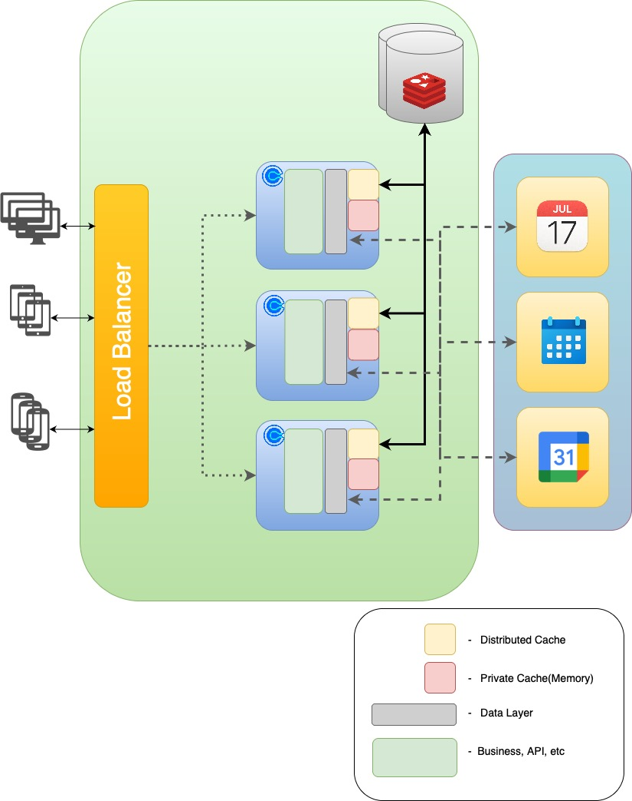

# Caching for Throughput Cash
## Exercise Assumptions
* Latency issues are caused either by the network or the downstream Calendar services(Google, Microsoft, Apple, etc). i.e. the recommendation will not be focusing on performance issues caused internally by algorithms on the applications servers themselves
* The data is a combination of dynamic and static data with various levels of non-functional performance requirements; e.g data can be:
    * Somewhat stale(e.g. Zillow property likes)
    * Updated immediated. (e.g. Meeting acceptance)

* Architecture
    * Multiple instances of the same service
    * Load balancer fronting the system. 
    * The software is constructed so that all calendar API interaction flows through a particular module.
  
The below diagram captures how I envisioned problem space and along with the recommended solution.

## Recommendations

* There is not a one size fits all approach. A hybrid approach is recommended that takes into consideration three characteristics about the data
    * Static vs Dynamic
    * Usage patterns(low writes vs high reads, high write and high reads)
    * Latency requirements(Zillow likes(loose) vs appointment bookings(strict))

* Static data
    * Use a private cache(see above). Cache could be configured with a long TTL and a LFU eviction policy
    * While the data may be static, if it takes awhile to initally load a cold start, seeding setup may be warranted
* Dynamic data, loose latency requirements
    * Use private cache with lower TTL
    * e.g. example Zillow likes
* Dynamic data, strict latency requirements
    * Use a distributed cache solution like Redis
    * Recommend a cache-aside strategy. However a write-thru or write-back strategy could be considered based on usage patterns and other requirements.
        * If write-back is used - a mitigation strategy must be in place for when the cache fails during the write back process
    * Other challenges
        * All data must flow through the module that manages the cache or data will get out of sync
        * Verify source of truth has been updated before updating cache
            * Concurrency controls should be in place for resource with heavy writes. Cache should react to these concurrency controls accordingly.
        * Cache service should be redundant, however the API services must still be operable if the cache solution is down.

* Monitor the cache. 
    * Cache statistics(hits, misses) should be kept to verify assumptions. The implementation for different sets of data can then be tweaked based how the implementations perform.

## Other thoughts
* Could memoization help?